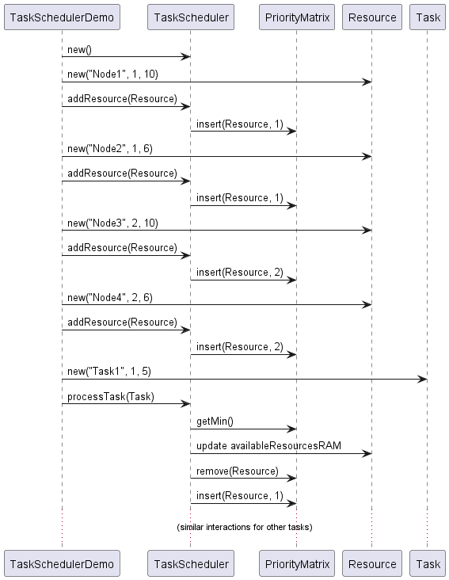
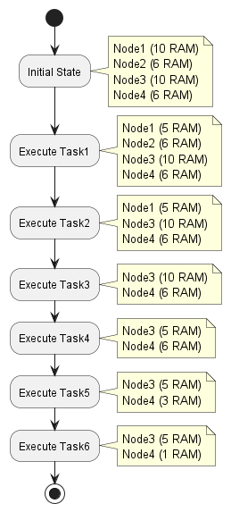

# PriorityMatrix - DataStructure co-developed with GPT4

This data structure named **PriorityMatrix** developed with the help of GPT4.

Included is a project with related samples of using the data structure.

**Data structure class:**

[See PriorityMatrix.java](src/practice/PriorityMatrix.java)

**Description:**

A Priority Matrix is a two-dimensional data structure that combines the concept of a priority queue with a matrix. Each element in the matrix has an associated priority value, and elements can be accessed and manipulated based on their priorities. The primary operations supported by the Priority Matrix are insertion, deletion, and retrieval of elements based on their priorities. The underlying structure can be implemented as a balanced tree or a heap of heaps to maintain efficient runtime complexity.

The Priority Matrix is useful when we need to maintain a collection of elements with priorities in a grid-like structure, and operations need to be performed based on their priorities.

**Examples of use cases:**

1. Task scheduling: In an operating system, the Priority Matrix can be used to manage processes or tasks based on their priorities and resource requirements (such as CPU and memory). The matrix can be organized with rows representing priorities and columns representing resource availability, making it easy to allocate and deallocate resources according to the priority of tasks.
2. Game AI: In pathfinding algorithms such as A* or Dijkstra, the Priority Matrix can be used to store nodes in the search space with their priorities being the cost function values. This would allow efficient access to the next node with the lowest cost, speeding up the pathfinding process.
3. Image processing: In image segmentation, the Priority Matrix can be used to store pixels with their priorities being the intensity values. This allows for efficient access and manipulation of pixels based on their intensity, which can be useful for various image processing tasks like edge detection and filtering.
4. Load balancing: In distributed systems, the Priority Matrix can be used to manage the allocation of tasks to different servers or nodes based on their workload and priority. The matrix can be organized with rows representing priorities and columns representing available nodes, making it easy to distribute tasks efficiently according to their priority and available resources.
5. Sparse data representation: When working with large sparse datasets, the Priority Matrix can be used to store non-zero elements and their priorities efficiently. This can be useful in various applications like sparse matrix multiplication or graph processing algorithms, where operations need to be performed based on the non-zero elements' priorities.

**Example of how PriorityMatrix is used in a sample usecase:**

Tasks are scheduled based on CPU class and RAM availability.

[See TaskSchedulerDemo.java](docs/TaskSchedulerDemo.java)

Sequence diagram for Task scheduling demo:

Activity diagram that shows how PriorityMatrix is updated through execution of demo:

**Suggested future improvements:**

1. Customizable priority update strategy: The updatePriority() method currently removes the element and then inserts it again with the updated priority. This strategy might not be the most efficient way of updating priorities in all scenarios. The PriorityMatrix class could be redesigned to allow users to provide their priority update strategy, such as an interface with a method to handle priority updates.

2. Additional utility methods: The PriorityMatrix class could benefit from additional utility methods, such as methods for bulk insertion and removal of elements, methods for merging multiple PriorityMatrix instances, or methods for filtering elements based on custom criteria.

3. Thread-safety: If the PriorityMatrix class is intended to be used in concurrent environments, consider adding thread-safety features such as using ConcurrentSkipListMap instead of TreeMap and synchronizing access to methods that modify the PriorityMatrix. Alternatively, provide a separate thread-safe implementation of the PriorityMatrix class.

4. Null element handling: The PriorityMatrix does not handle null elements, and the current design might lead to NullPointerExceptions. Consider adding null checks and handling in methods that accept elements as input or return elements.