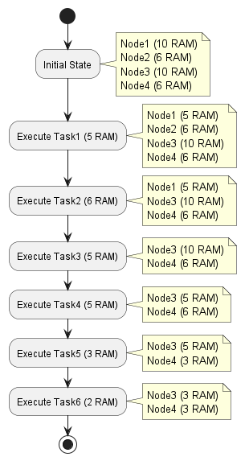
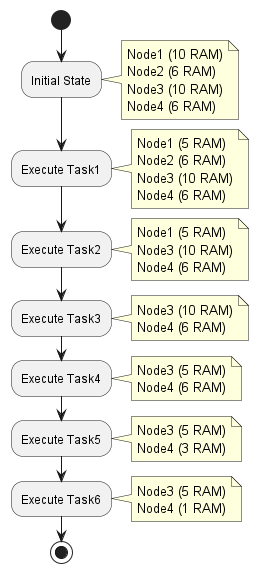

# PriorityMatrix - DataStructure co-developed with GPT4

This data structure named **PriorityMatrix** developed with the help of GPT4.

Included is a project with related samples of using the data structure.

**Data structure class:**

[See PriorityMatrix.java](src/practice/PriorityMatrix.java)

**Example of how PriorityMatrix is used in a sample usecase.**

Tasks are scheduled based on CPU class and RAM availability.

[See TaskSchedulerDemo.java](src/practice/TaskSchedulerDemo.java)

Sequence diagram for Task scheduling demo:

Activity diagram that shows how PriorityMatrix is updated through execution of demo:

